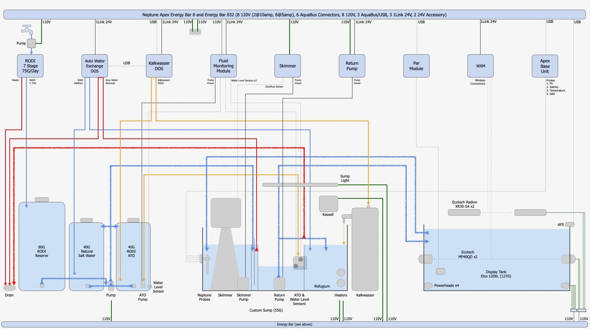

# System Overview




# Neptune Apex Programming


## Feed A, B, C, and D

In summary I've programmed the four Feed macros on the Apex as follows:
- Feed A: Feed mode: Mysis, et al
- Feed B: Wave mode: Demo mode
- Feed C: Siphon mode: Siphon out the display tank
- Feed D: Maintenance mode: Most subystems are off


### Feed A: Feed

- Note: The Feed-Timer is used for auto-feeding pellets via the
  Neptune AFS.  The Feed A macro is used for feeding the fish
  manually with mysis, et al.  The auto feeding mechanism is a super
  set of the manually feeding mechanism.
- Utilizes the **Feed** and **MP40-Feed** virtual outlets and the **MP40-Feed** Profile
- 15 minutes
- MP40s MP40-Feed (10% Nutrient)
- Powerheads off
- Radions 100%
- Dependency chain (for Feed A or Feed-Timer)
  - Feed-Timer ON -> Feed ON
  - Feed A ON -> Feed ON
  - Feed ON -> MP40 MP40-Feed, Powerheads OFF, Radions 100%
  - Feed-Timer ON -> Feed-AFS ON

**Feed** Virtual Outlet
```
Fallback OFF
Set OFF
If FeedA 000 Then ON
If Output Feed-Timer = ON Then ON
If Outlet Maintenance = ON Then OFF
```


### Feed B: Wave

- Utilizes the **MP40-Pulse** virtual outlet and the **MP40-Pulse** Profile
- 15 minutes
- MP40s MP40-Pulse
- Radions 100%
- Dependency chain
  - Feed B ON -> MP40-Pulse ON
  - MP40-Pulse ON -> MP40 MP40-Pulse, Radion 100%


### Feed C: Siphon

- Utilizes the **Siphon** virtual outlet
- Quasi-infinite
- MP40s off
- Powerheads off
- Radions 100%
- Dependency chain
  - Feed C ON -> Siphon ON
  - Siphon ON -> MP40 OFF, Powerheads OFF, Radions 100%

**Siphon** Virtual Outlet
```
Fallback OFF
Set OFF
If FeedC 000 Then ON
```


### Feed D: Maintenance

- Utilizes the **Maintenance** virtual outlet
- Quasi-infinite
- MP40s off
- Powerheads off
- Radions 100%
- Return off
- Skimmer off
- ATO OFF
- AWE OFF
- Kalk OFF
- Feed OFF
- Feed-Timer OFF
- Dependency chain:
  - Feed D ON -> Maintenance ON
  - Maintenance ON -> Return OFF, MP40s OFF, Powerheads OFF, Radions OFF, AWE OFF, Kalk OFF
  - Return OFF -> Skimmer OFF, ATO-Enabled OFF
  - Skimmer OFF -> ATO-Enabled OFF
  - ATO-Enabled OFF -> ATO OFF

**Maintenance** virtual outlet
```
Fallback OFF
Set OFF
If FeedD 000 Then ON
```


## Return Pump

Type: Neptune COR-15 Return Pump

**Return** Outlet
```
Fallback ON
Set ON
If Outlet Maintenance = ON Then OFF
```


## Skimmer

Always defer the start to enable the water levels to stabilize.

**Skimmer** Outlet
```
Fallback OFF
Set ON
If Output Return = OFF Then OFF
Defer 005:00 Then ON
```


## Auto Top Off System


### Probes

- **ATO-LO**: Sump low water probe
- **ATO-HI**: Sump high water probe
- **ATO-WL**: ATO container low water probe


### ATO-LO-Alarm

Enables an alarm if the water level has been below the ATO-LO probe
for too long.

**ATO-LO-Alarm** Virtual Outlet
```
Fallback OFF
Set OFF
If ATO-LO OPEN Then ON
Defer 090:00 Then ON
```


### ATO-HI-Alarm

Enables an alarm if the water level has been above the ATO-HI probe
for too long.

**ATO-HI-Alarm** Virtual Outlet
```
Set OFF
If ATO-HI CLOSED Then ON
Defer 090:00 Then ON
```


### ATO-Enabled

**ATO-Enabled** Virtual Outlet
```
Fallback ON
Set ON
If Output Return = OFF Then OFF
If Output Skimmer = OFF Then OFF
Defer 005:00 Then ON
```


### ATO

**ATO** Outlet
```
Fallback OFF
Set OFF
If ATO-LO OPEN Then ON
If ATO-HI CLOSED Then OFF
If ATO-WL OPEN Then OFF
If Output ATO-Enabled = OFF Then OFF
When ON > 005:00 Then OFF
Defer 000:10 Then ON
Defer 000:04 Then OFF
Min Time 060:00 Then OFF
```


## MP40QDs

### MP40-L

**MP40-L** Outlet
```
Fallback MP40-Feed
tdata 00:00:00,0,0,10,0,0,0,0,0,0,0,0,0,0
tdata 05:00:00,0,0,15,2,0,0,0,0,0,0,0,0,0
tdata 07:00:00,0,0,20,7,0,0,0,0,0,0,0,0,0
tdata 08:45:00,0,0,80,1,0,0,0,0,0,0,0,0,0
tdata 10:15:00,0,0,60,7,0,0,0,0,0,0,0,0,0
tdata 11:45:00,0,0,100,8,0,0,0,0,0,0,0,0,0
tdata 13:15:00,0,0,80,1,0,0,0,0,0,0,0,0,0
tdata 14:30:00,0,0,100,8,0,0,0,0,0,0,0,0,0
tdata 16:20:00,0,0,60,7,0,0,0,0,0,0,0,0,0
tdata 18:00:00,0,0,100,3,200,0,0,0,0,0,0,0,0
tdata 19:29:00,0,0,68,1,0,0,0,0,0,0,0,0,0
tdata 20:00:00,0,0,30,7,0,0,0,0,0,0,0,0,0
tdata 21:00:00,0,0,15,2,0,0,0,0,0,0,0,0,0
tdata 23:59:00,0,0,10,0,0,0,0,0,0,0,0,0,0
If Output Siphon = ON Then OFF
If Output Maintenance = ON Then OFF
If Output MP40-Feed = ON Then MP40-Feed
If Output MP40-Const = ON Then MP40-Const
If Output MP40-Lagoon = ON Then MP40-Lagoon
If Output MP40-Nutr = ON Then MP40-Nutr
If Output MP40-Pulse = ON Then MP40-Pulse
If Output MP40-ReefC = ON Then MP40-ReefC
If Output MP40-Tidal = ON Then MP40-Tidal
```


### MP40-R

**MP40-R** Outlet
```
Fallback MP40-Feed
tdata 00:00:00,0,0,10,0,0,0,0,0,0,0,0,0,0
tdata 05:00:00,0,0,15,2,0,0,0,0,0,0,0,0,0
tdata 07:00:00,0,0,20,7,0,0,0,0,0,0,0,0,0
tdata 08:45:00,0,0,80,1,0,0,0,0,0,0,0,0,0
tdata 10:15:00,0,0,60,7,0,0,0,0,0,0,0,0,0
tdata 11:45:00,0,0,100,8,0,0,0,0,0,0,0,0,0
tdata 13:15:00,0,0,80,1,0,0,0,0,0,0,0,0,0
tdata 14:30:00,0,0,100,8,0,0,0,0,0,0,0,0,0
tdata 16:20:00,0,0,60,7,0,0,0,0,0,0,0,0,0
tdata 18:00:00,0,0,100,3,200,0,0,0,0,0,0,0,0
tdata 19:29:00,0,0,68,1,0,0,0,0,0,0,0,0,0
tdata 20:00:00,0,0,30,7,0,0,0,0,0,0,0,0,0
tdata 21:00:00,0,0,15,2,0,0,0,0,0,0,0,0,0
tdata 23:59:00,0,0,10,0,0,0,0,0,0,0,0,0,0
If Output Siphon = ON Then OFF
If Output Maintenance = ON Then OFF
If Output MP40-Feed = ON Then MP40-Feed
If Output MP40-Const = ON Then MP40-Const
If Output MP40-Lagoon = ON Then MP40-Lagoon
If Output MP40-Nutr = ON Then MP40-Nutr
If Output MP40-Pulse = ON Then MP40-Pulse
If Output MP40-ReefC = ON Then MP40-ReefC
If Output MP40-Tidal = ON Then MP40-Tidal
```


## Powerheads

**Powerheads** Outlet
```
Fallback ON
Set OFF
If Time 08:00 to 22:00 Then ON
If Outlet Feed = ON Then OFF
If Outlet Siphon = ON Then OFF
If Outlet Maintenance = ON Then OFF
```


## Ecotech Radion XR30w G4 LED Lights

Strict AB+ from 12:00pm to 8pm, 1 hour ramp up and down from 0% to
100% intensity, 7 hours at maximum intensity.
- 24%: Red, Green, Cool White, Warm White
- 100%: Blue, Royal Blue, Ultra Violet, Violet


### Radion-L

FOWLR

**Radion-L** Outlet
```
Fallback OFF
tdata 00:00:00,0,0,0,0,0,0,0,0,0,0,0,0,0
tdata 12:00:00,0,0,0,0,0,0,0,0,0,0,0,0,0
tdata 13:00:00,0,0,100,24,24,100,100,100,24,24,100,0,0
tdata 20:00:00,0,0,100,24,24,100,100,100,24,24,100,0,0
tdata 21:00:00,0,0,2,24,24,100,100,100,24,24,100,0,0
tdata 22:00:00,0,0,1,24,24,100,100,100,24,24,100,0,0
tdata 23:59:00,0,0,0,0,0,0,0,0,0,0,0,0,0
If Output Feed = ON Then 100
If Output Siphon = ON Then 100
If Output Maintenance = ON Then 100
If Output MP40-Feed = ON Then 100
If Output MP40-Const = ON Then 100
If Output MP40-Lagoon = ON Then 100
If Output MP40-Nutr = ON Then 100
If Output MP40-Pulse = ON Then 100
If Output MP40-ReefC = ON Then 100
If Output MP40-Tidal = ON Then 100
```

AB+

**Radion-L** Outlet
```
Fallback OFF
tdata 00:00:00,0,0,0,0,0,0,0,0,0,0,0,0,0
tdata 12:00:00,0,0,0,0,0,0,0,0,0,0,0,0,0
tdata 13:00:00,0,0,100,24,24,100,100,100,24,24,100,0,0
tdata 20:00:00,0,0,100,24,24,100,100,100,24,24,100,0,0
tdata 21:00:00,0,0,2,24,24,100,100,100,24,24,100,0,0
tdata 22:00:00,0,0,1,24,24,100,100,100,24,24,100,0,0
tdata 23:59:00,0,0,0,0,0,0,0,0,0,0,0,0,0
If Output Feed = ON Then 100
If Output Siphon = ON Then 100
If Output Maintenance = ON Then 100
If Output MP40-Feed = ON Then 100
If Output MP40-Const = ON Then 100
If Output MP40-Lagoon = ON Then 100
If Output MP40-Nutr = ON Then 100
If Output MP40-Pulse = ON Then 100
If Output MP40-ReefC = ON Then 100
If Output MP40-Tidal = ON Then 100
```


### Radion-R

FOWLR

**Radion-R** Outlet
```
Fallback OFF
tdata 00:00:00,0,0,0,0,0,0,0,0,0,0,0,0,0
tdata 12:00:00,0,0,0,0,0,0,0,0,0,0,0,0,0
tdata 13:00:00,0,0,100,24,24,100,100,100,24,24,100,0,0
tdata 20:00:00,0,0,100,24,24,100,100,100,24,24,100,0,0
tdata 21:00:00,0,0,2,24,24,100,100,100,24,24,100,0,0
tdata 22:00:00,0,0,1,24,24,100,100,100,24,24,100,0,0
tdata 23:59:00,0,0,0,0,0,0,0,0,0,0,0,0,0
If Output Feed = ON Then 100
If Output Siphon = ON Then 100
If Output Maintenance = ON Then 100
If Output MP40-Feed = ON Then 100
If Output MP40-Const = ON Then 100
If Output MP40-Lagoon = ON Then 100
If Output MP40-Nutr = ON Then 100
If Output MP40-Pulse = ON Then 100
If Output MP40-ReefC = ON Then 100
If Output MP40-Tidal = ON Then 100
```

AB+

**Radion-R** Outlet
```
Fallback OFF
tdata 00:00:00,0,0,0,0,0,0,0,0,0,0,0,0,0
tdata 12:00:00,0,0,0,0,0,0,0,0,0,0,0,0,0
tdata 13:00:00,0,0,100,24,24,100,100,100,24,24,100,0,0
tdata 20:00:00,0,0,100,24,24,100,100,100,24,24,100,0,0
tdata 21:00:00,0,0,2,24,24,100,100,100,24,24,100,0,0
tdata 22:00:00,0,0,1,24,24,100,100,100,24,24,100,0,0
tdata 23:59:00,0,0,0,0,0,0,0,0,0,0,0,0,0
If Output Feed = ON Then 100
If Output Siphon = ON Then 100
If Output Maintenance = ON Then 100
If Output MP40-Feed = ON Then 100
If Output MP40-Const = ON Then 100
If Output MP40-Lagoon = ON Then 100
If Output MP40-Nutr = ON Then 100
If Output MP40-Pulse = ON Then 100
If Output MP40-ReefC = ON Then 100
If Output MP40-Tidal = ON Then 100
```


## Auto Water Exchange System

There are 3 "sets" of schemes saved publicly for AWE handling 10%,
15%, and 20% auto water exchanges respectively.  Here's the
calculations:
- Total tank/sump volume (minus live rock et al) is 125G
- 10% change: 12.5G/W, 1.79G/D, 6.76L/D, 677ML/D
- 15% change: 18.75G/W, 2.68G/D, 10.14L/D, 1014ML/D
- 20% change: 25G/W, 3.58G/D, 13.52L/D, 1352ML/D


### AWE-Old

**AWE-Old** Outlet
```
Fallback OFF
tdata 00:00:00,1,5,0,78,2,148,130,0,78,2,28,11,0
Fallback ON
Set ON
If Output Maintenance = ON Then OFF
```


### AWE-New

**AWE-New** Outlet
```
Fallback OFF
tdata 00:00:00,1,21,0,78,2,148,130,0,78,2,28,11,0
Fallback ON
Set ON
If Output Maintenance = ON Then OFF
```


## Feed

### **Feed-Timer** Virtual Outlet

```
Fallback OFF
Set OFF
If Time 10:00 to 10:10 Then ON
If Time 14:00 to 14:10 Then ON
If Time 20:00 to 20:10 Then ON
If Outlet Maintenance = ON Then OFF
```


### Feed-AFS

**Feed-AFS** Virtual Outlet
```
Fallback OFF
Set OFF
If Output Feed-Timer = ON Then ON
Defer 000:30 Then ON
```


## Kalkwasser

### Kalk-Stirrer

**Kalk-Stirrer** Outlet
```
Fallback ON
Set ON
If Outlet Maintenance = ON Then OFF
```


### Kalk DOS

**Kalk-DOS** Outlet
```
tdata tbd
Fallback ON
Set ON
If Output Maintenance = ON Then OFF
```


## Heater1

**Heater1** Outlet
```
77.9 - 78.1
```


## Heater2

**Heater2** Outlet
```
78.0 - 78.1
```


## Sump Light

Turn on the outlet for the LED over the sump.  If the outlet is on,
the LED is then turned on/off using a physical switch on the LED
itself.

**Sump-Light** Outlet
```
Fallback OFF
Set OFF
If Time 08:00 to 22:00 Then ON
```


## System Alarms


### Apex-Warn

**Apex-Warn** Outlet
```
Fallback OFF
Set OFF
```


### Apex-Alarm

**Apex-Alarm** Outlet
```
Fallback OFF
Set OFF
If Error ATO Then ON
If Error Return Then ON
```


### Apex-SMS

**Apex-SMS** Outlet
```
Fallback OFF
Set OFF
If Error ATO Then ON
If Error Return Then ON
If pH > 8.60 Then ON
If pH < 8.00 Then ON
If Tmp > 82.0 Then ON
If Tmp < 75.0 Then ON
If ORP < 250 Then ON
If ORP > 450 Then ON
If ATO-WL OPEN Then ON
If Output ATO-LO-Alarm = ON Then ON
If Output ATO-HI-Alarm = ON Then ON
```


## Booster Pump

Type: Aquatec CDP 8800

The Aquatec CDP 8800 booster pump increases the water pressure going
into my RO/DI system ensuring that I can product ~75GPD.

**Booster-Pump** Outlet
```
Fallback ON
Set ON
```


## MP40 Profiles and Virtual Outlets

I've created a handful of different profiles to run the MP40s in
different modes.


### **MP40-Const** Profile: Constant mode at 100%

Activation:
- Activated when MP40-Const is ON

**MP40-Const** Virtual Outlet
```
Fallback OFF
Set OFF
```


### **MP40-Feed** Profile: Nutrient mode at 10%

Activation:
- Activated when Feed is ON (triggered by Feed A or Feed-Timer)
- Activated when MP40-Feed is ON

**MP40-Feed** Virtual Outlet
```
Fallback OFF
Set OFF
If Outlet Feed = ON Then MP40-Feed
```


### **MP40-Lagoon** Profile: Lagoon mode at 100%

Activation:
- Activated when MP40-Lagoon is ON

**MP40-Lagoon** Virtual Outlet
```
Fallback OFF
Set OFF
```


### **MP40-Nutr** Profile: Nutrient mode at 100%

Activation:
- Activated when MP40-Nutr is ON

**MP40-Nutr** Virtual Outlet
```
Fallback OFF
Set OFF
```


### **MP40-Pulse** Profile: Pulse mode at 100%

Activation:
- Activated when MP40-Pulse is ON
- Activated when Feed B is ON

**MP40-Pulse** Virtual Outlet
```
Fallback OFF
Set OFF
If FeedB 000 Then ON
```


### **MP40-ReefC** Profile: ReefCrest mode at 100%

Activation:
- Activated when MP40-ReefC is ON

**MP40-ReefC** Virtual Outlet
```
Fallback OFF
Set OFF
```


### **MP40-Tidal**: Tidal mode at 100%

Activation:
- Activated when MP40-Tidal is ON

**MP40-Tidal** Virtual Outlet
```
Fallback OFF
Set OFF
```
